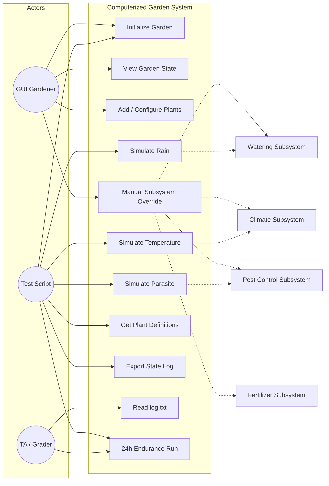
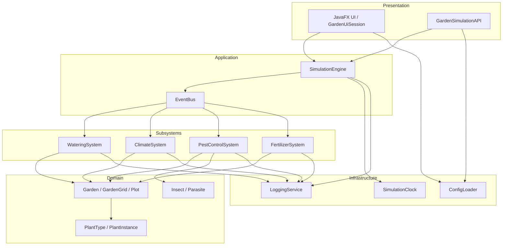
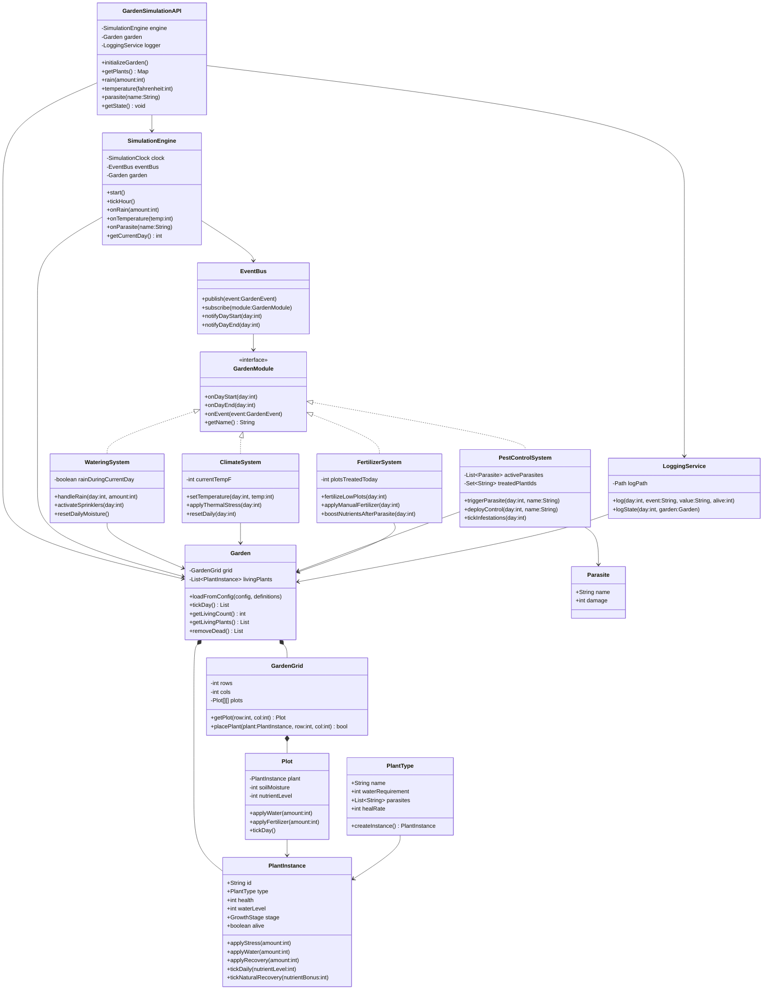
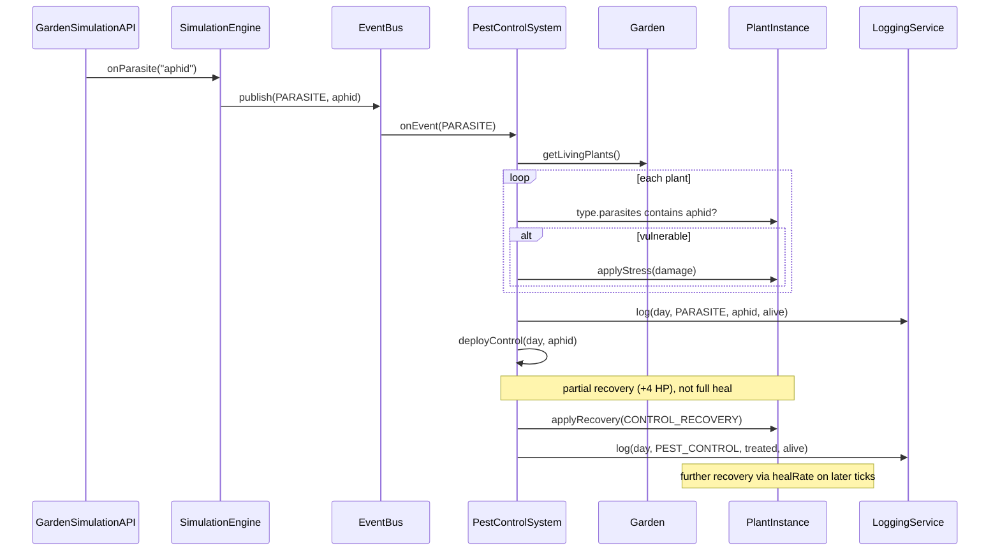
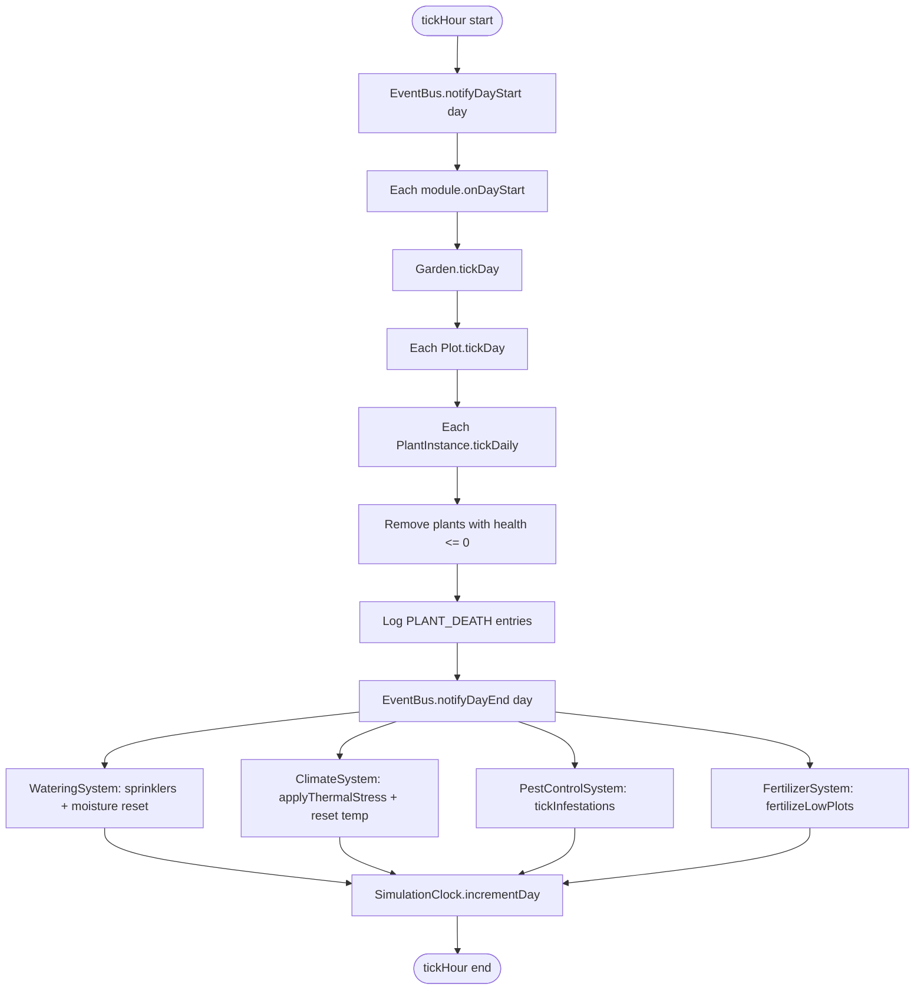
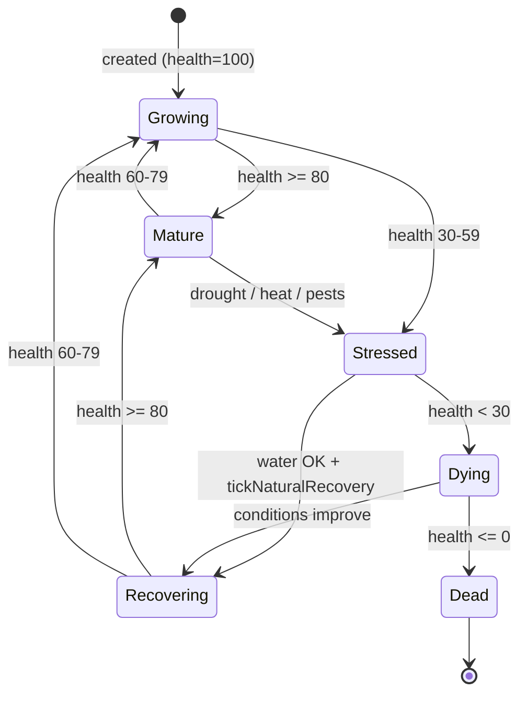
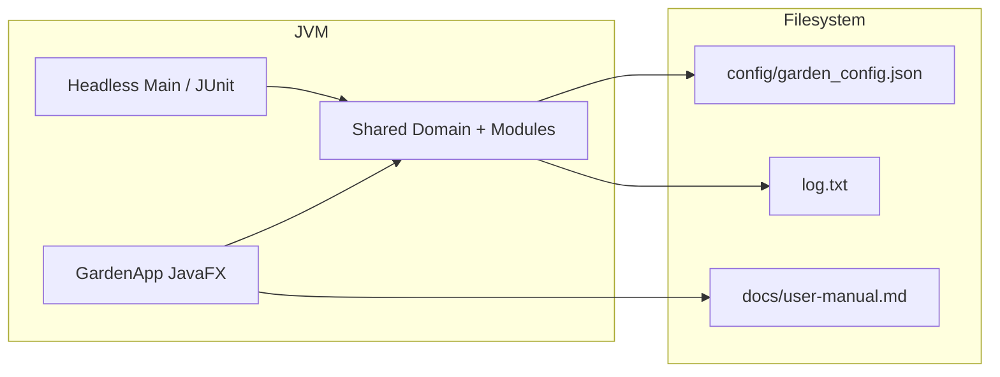

# CSEN275 Computerized Garden System — UML Design

> This document includes the main UML views required for the course. Render diagrams in [PlantUML](https://plantuml.com/) or any Mermaid-compatible editor.

---

## 1. Use Case Diagram



> **Note:** Manual fertilizer (`FertilizerSystem.applyManualFertilizer`) is a GUI-only override under UC4. The headless API exposes rain, temperature, and parasite events only.

---

## 2. Component Diagram



---

## 3. Class Diagram (Core)



---

## 4. Sequence Diagram — 24-Hour API Test Flow

Each API environment call publishes an event, then advances one simulated day via `tickHour()`.

```mermaid
sequenceDiagram
    participant Script
    participant API as GardenSimulationAPI
    participant Engine as SimulationEngine
    participant Bus as EventBus
    participant Module as GardenModule
    participant Garden
    participant Logger as LoggingService

    Script->>API: initializeGarden()
    API->>Garden: loadFromConfig(config, definitions)
    API->>Engine: start()
    Engine->>Logger: log(0, INIT, config_loaded, aliveCount)

    loop 24 simulated hours (= 24 days)
        Script->>API: rain / temperature / parasite
        alt Rain
            API->>Engine: onRain(amount)
            Engine->>Bus: publish(RAIN)
            Bus->>Module: onEvent(RAIN)
            Module->>Garden: apply water to plots
        else Temperature
            API->>Engine: onTemperature(temp)
            Engine->>Bus: publish(TEMPERATURE)
            Bus->>Module: onEvent(TEMPERATURE)
            Module->>Module: setTemperature(day, temp)
        else Parasite
            API->>Engine: onParasite(name)
            Engine->>Bus: publish(PARASITE)
            Bus->>Module: onEvent(PARASITE)
            Module->>Garden: apply stress to vulnerable plants
        end

        API->>Engine: tickHour()
        Engine->>Bus: notifyDayStart(day)
        Bus->>Module: onDayStart(day)
        Engine->>Garden: tickDay()
        Garden->>Garden: plot.tickDay() + removeDead()
        Engine->>Bus: notifyDayEnd(day)
        Bus->>Module: onDayEnd(day)
        Note over Module: sprinklers, thermal stress,<br/>fertilize low plots, tick infestations
        Engine->>Engine: incrementDay()
    end

    Script->>API: getState()
    API->>Logger: logState(day, garden)
    Note over Script,Logger: Final state written to log.txt;<br/>Script may also call getPlants()
```

---

## 5. Sequence Diagram — Parasite Handling



---

## 6. Activity Diagram — Simulated Day Loop (tickHour)

Environment events (rain, temperature, parasite) are applied **before** `tickHour()` via `EventBus.publish()` when the API or GUI triggers them. Fertilizer runs automatically during `onDayEnd`.



---

## 7. State Diagram — PlantInstance Lifecycle

Conceptual view aligned with `PlantInstance.updateStageFromHealth()`. New plants start in `GROWING` (not `SEEDLING`).



---

## 8. Deployment View (Logical)



---

## 9. Recommended Package Structure

```
com.csen275.garden
├── api/           GardenSimulationAPI
├── app/           GardenApp (JavaFX), HeadlessSimulationRunner
├── config/        ConfigLoader, GardenConfig
├── domain/
│   ├── garden/    Garden, GardenGrid, Plot
│   ├── plant/     PlantType, PlantInstance, GrowthStage
│   ├── insect/    Insect, Parasite
│   └── sensor/    Sensor, Sprinkler, Thermometer
├── module/        GardenModule, Watering, Climate, PestControl, Fertilizer
├── simulation/    SimulationEngine, SimulationClock, EventBus, EnvironmentEventGenerator
├── event/         GardenEvent, EventType
├── logging/       LoggingService
└── ui/            controllers, views, help
```

---

## 10. Design Decision Summary

| Decision | Rationale |
|----------|-----------|
| API and GUI share domain layer | Avoid duplicate logic; satisfy standalone API testing |
| `GardenModule` interface | Meets “≥3 independent modules” grading requirement |
| `EventBus` decoupling | Rain/climate/pest events routed to all modules without direct engine coupling |
| Events before `tickHour()` | API methods publish environment events, then advance the simulated day |
| `PlantType` vs `PlantInstance` | Type definition vs runtime instance; supports `getPlants()` |
| Automatic vs manual fertilizer | Low-nutrient plots fertilized in `onDayEnd`; GUI can trigger manual override |
| Relative paths for config/logs | Required by API specification |
| Pest control without instant full heal | `deployControl` applies partial recovery; full recovery is gradual via `healRate` |
