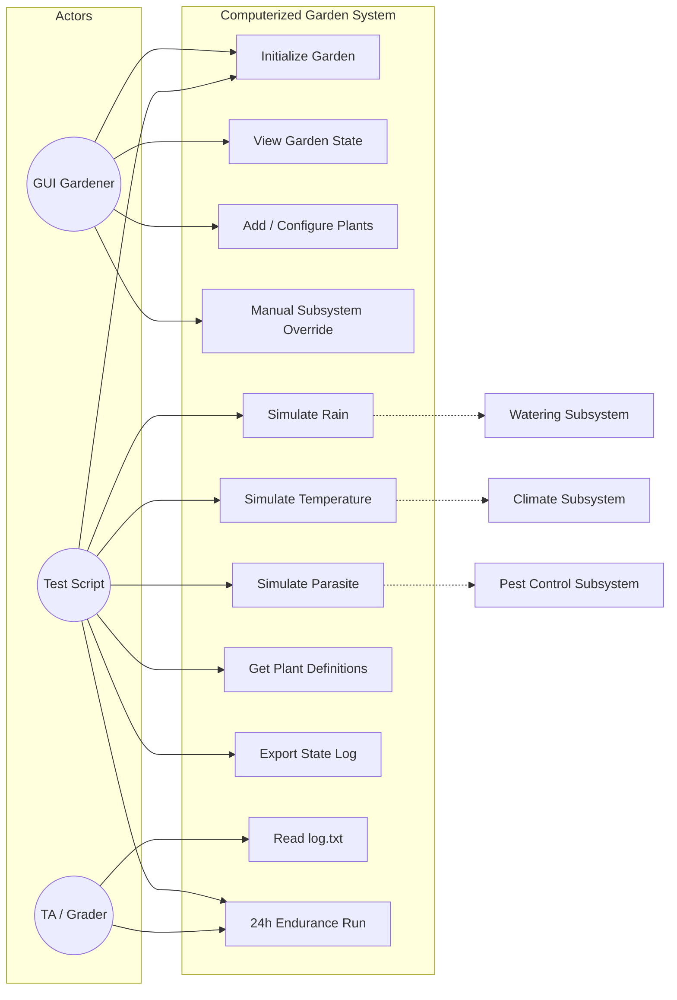
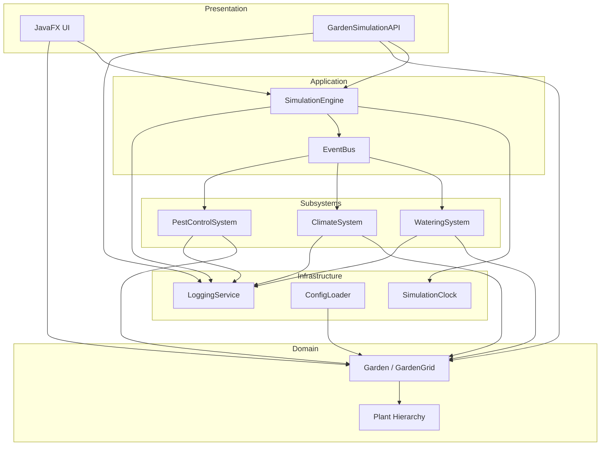
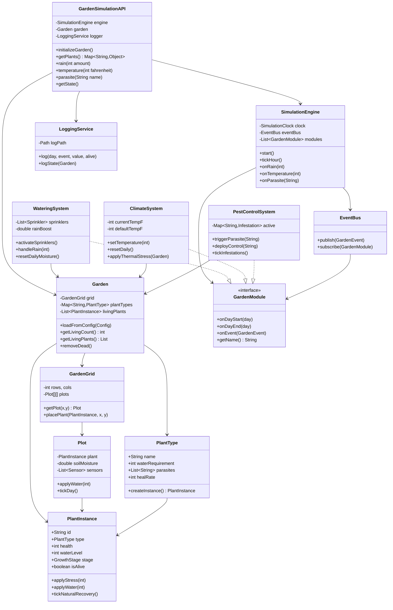
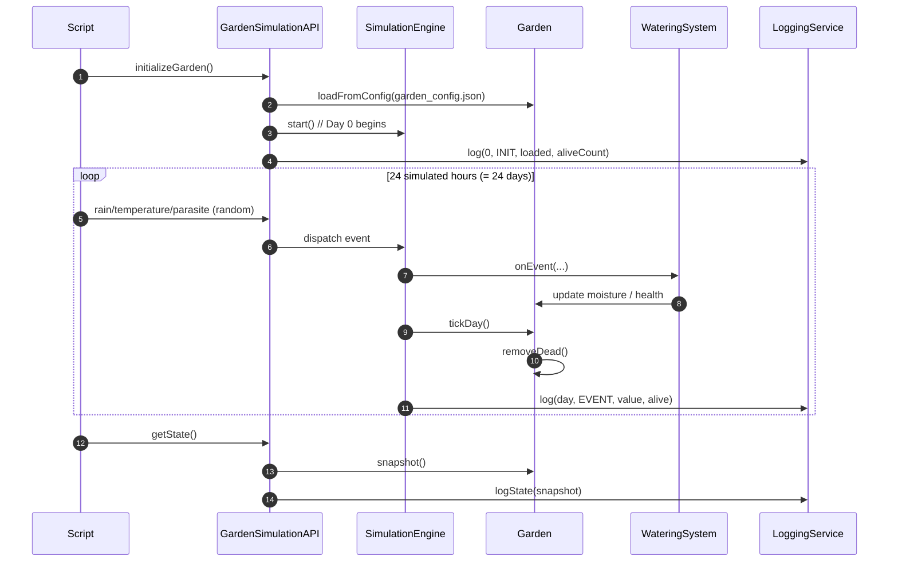
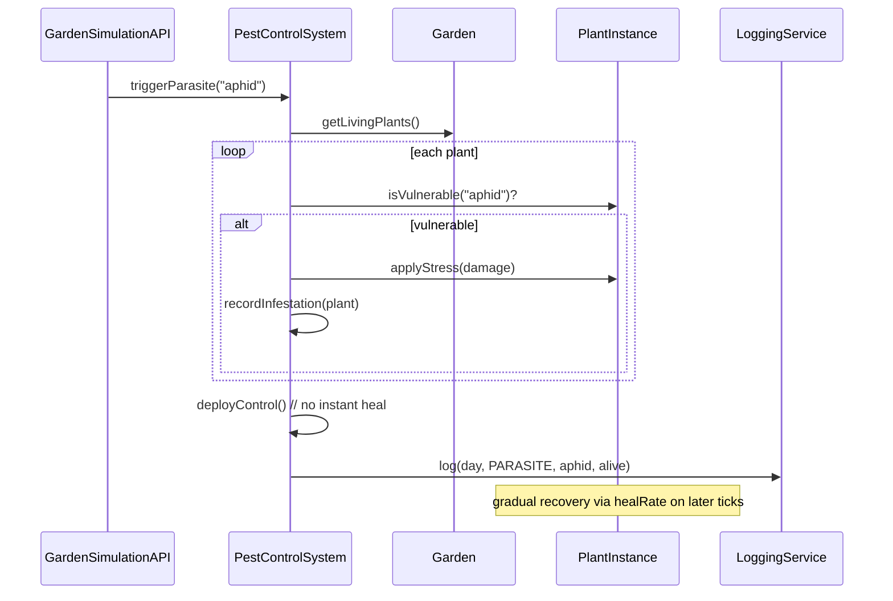
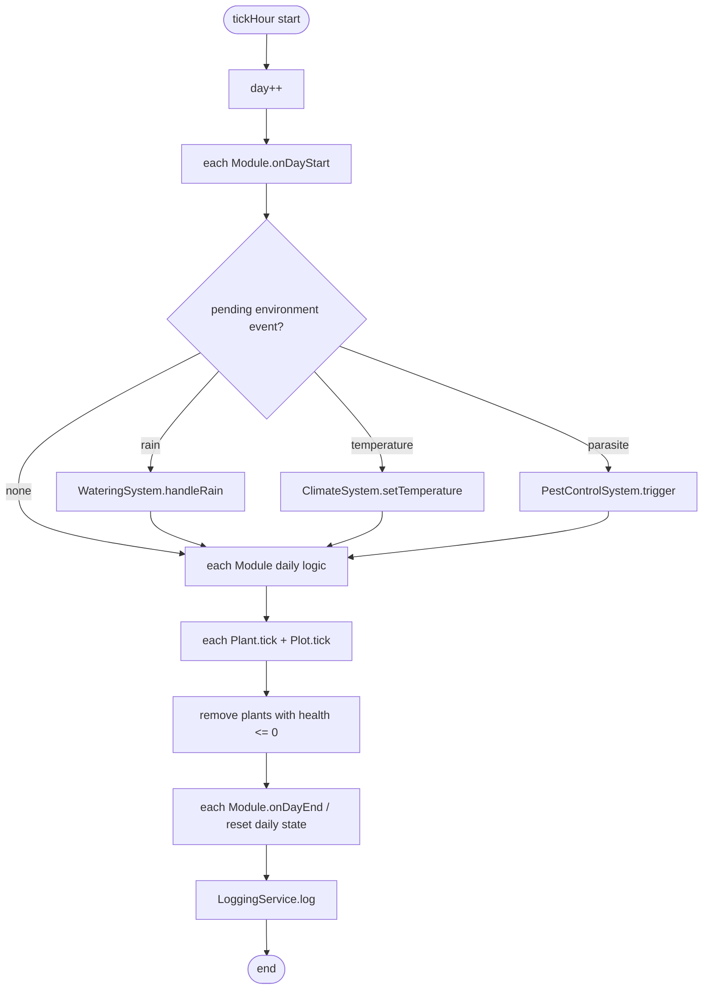
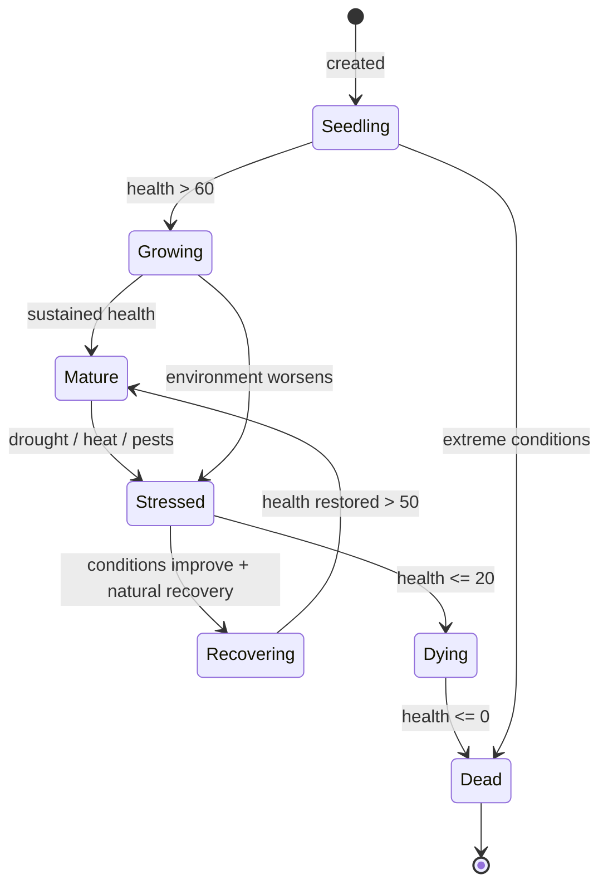
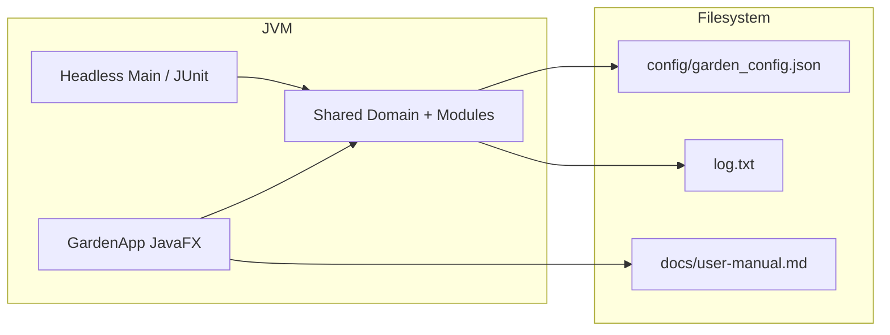

# CSEN275 Computerized Garden System — UML Design

> This document includes the main UML views required for the course. Render diagrams in [PlantUML](https://plantuml.com/) or any Mermaid-compatible editor.

---

## 1. Use Case Diagram



---

## 2. Component Diagram



---

## 3. Class Diagram (Core)



---

## 4. Sequence Diagram — 24-Hour API Test Flow



---

## 5. Sequence Diagram — Parasite Handling



---

## 6. Activity Diagram — Simulated Day Loop (tickHour)



---

## 7. State Diagram — PlantInstance Lifecycle



---

## 8. Deployment View (Logical)



---

## 9. Recommended Package Structure

```
com.csen275.garden
├── api/           GardenSimulationAPI
├── app/           GardenApp (JavaFX), HeadlessRunner
├── config/        ConfigLoader, GardenConfig
├── domain/
│   ├── garden/    Garden, GardenGrid, Plot
│   ├── plant/     PlantType, PlantInstance, GrowthStage
│   └── sensor/    Sensor, Sprinkler, Thermometer
├── module/        GardenModule, Watering, Climate, PestControl
├── simulation/    SimulationEngine, SimulationClock, EventBus
├── event/         GardenEvent, EventType
├── logging/       LoggingService
└── ui/            controllers, views, help
```

---

## 10. Design Decision Summary

| Decision | Rationale |
|----------|-----------|
| API and GUI share domain layer | Avoid duplicate logic; satisfy standalone API testing |
| `GardenModule` interface | Meets “≥3 independent modules” grading requirement |
| `EventBus` decoupling | Rain/climate/pest extensible and testable |
| `PlantType` vs `PlantInstance` | Type definition vs runtime instance; supports `getPlants()` |
| Relative paths for config/logs | Required by API specification |
| Pest control without instant heal | Required by API spec; reflected in Stressed→Recovering state |
